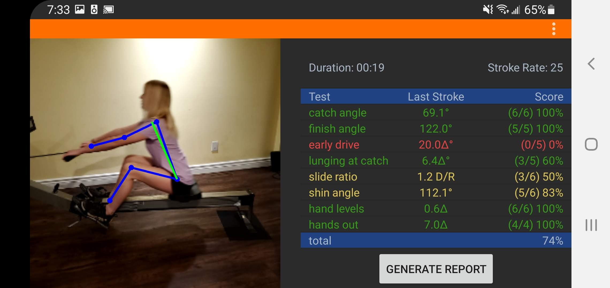
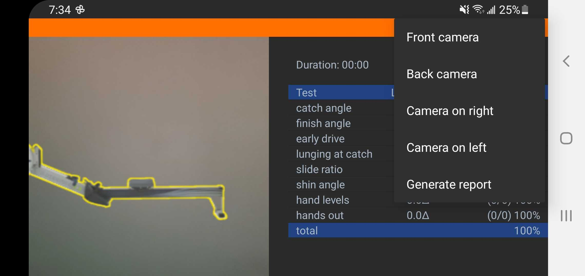
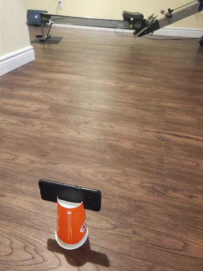
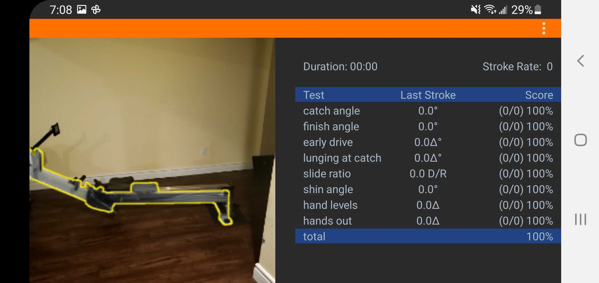

# ErgFlow for Android

ErgFlow is a coaching tool for rowers. It uses the phone's camera and computer vision to analyze a rower's stroke on a rowing machine.

It uses TensorFlow's [PoseNet](https://github.com/tensorflow/examples/tree/master/lite/examples/posenet/android) model for realtime human pose estimation. The detected poses are used to analyze the position of the rower's wrist, shoulder, hip, knee, and ankle throughout the stroke and check for common faults that can result in an inefficient rowing stroke.

If you have a way to cast your phone to a large screen using something like Chromecast then it is easier to get feedback while rowing.
If you have sound on then a voice will coach you if it detects three faults in a row.

It also creates a report that can be downloaded after the session.

[sample report](https://ergflow.github.io/samples/SampleReport.html)

## Demo App

https://play.google.com/store/apps/details?id=org.ergflow

## How to use the app

### Camera mount

* You will need a way to position your phone so that the camera can point in the right direction and that it doesn't move.
* There are lots of ways to do this:
  - Use back camera and place on ground leaning against something
  - Use a phone tripod mount
  - Create a [DIY phone mount](images/camera_mount.jpg)

### Cast your phone to a large screen

* This is not required but if you have a large screen with Chromecast in the room then it helps provide feedback while rowing. Otherwise, the phone will be too far away to see anything but you can still download the report at the end of the session.

### Positioning the phone

* Make sure there are no other people in the background or [anything else that may interfere with the detection](images/detectionError.png).
* You can use the front or back camera and can put the camera on the right or left side of the rowing machine. Select which camera and the side you want by tapping on the three dots to open the menu.

* Then place the phone about 10 feet away in the mount. 
* **It is recommended to plug the phone in. ErgFlow requires a lot of processing power and will drain the battery.**

* Adjust the position of the phone so that the ghost erg lines up with your rowing machine. The important thing is that the foot stretcher lines up, it is level, and that when you are rowing that you are in the frame throughout the stroke. 
 

* Start rowing. The ghost erg should disappear after a few strokes if detection is working.

### Rowing

* Try to keep your stroke rate in the low 20s to help with accuracy. 
* You can row for as long as you want but it only takes a couple of minutes to have enough strokes to detect faults in technique.
* The report will show images for the first 10 faults detected for each category,
* If you want to reset your session while on the erg you can raise your camera facing hand above your head for a few seconds to reset.

### Troubleshooting

#### Not detecting joints correctly

* Try to have a plain background. Sometimes things in the background can cause interference with detection.
* If there are other people or pictures of people then the detection may pick that up instead of you.
* Too much or too little lighting can reduce accuracy.
* Clothing has a big influence on detection. Rowing shorts often work better than track pants. Baggy clothes also reduce accuracy.

#### Shin angle is not right

* The TensorFlow model that is used is not very good at detecting ankles when on a rowing machine. ErgFlow will assume where your ankle is relative to the ghost erg image during setup. Move the camera or rowing machine so that the hard-coded ankle position lines up with your ankle.

#### Very laggy or only a couple of frames per second

* Sometimes closeing the app completely and restarting it fixes this.
* ErgFlow uses the Neural Network API which is very hardware dependent. Different makes and models of devices have different results. Older devices will likely not work as well.
* Close other apps that may be competing for resources.
